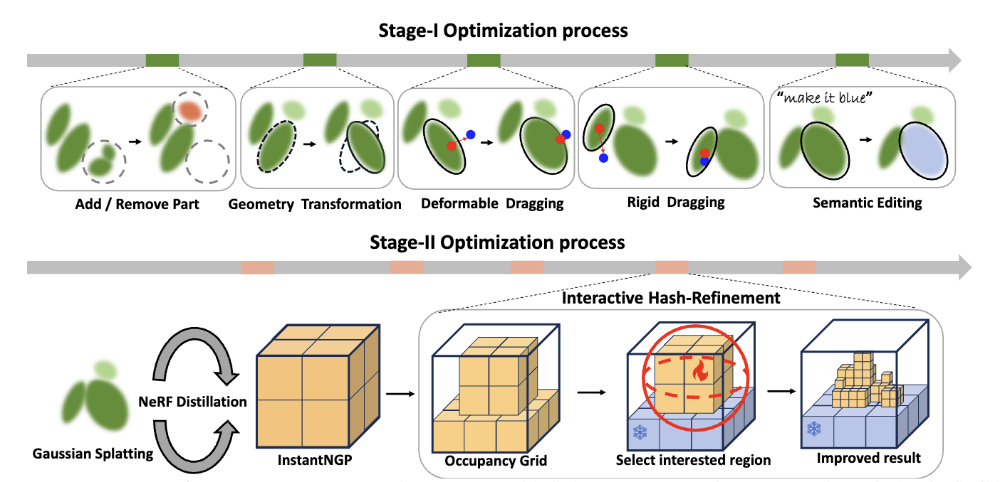

<div align="center">
    <a href='https://scholar.google.com/citations?user=Pee4FRsAAAAJ&hl=en' target='_blank'>Shaocong Dong<sup>1*</sup></a>&emsp;
    <a href='https://dinglihe.github.io/' target='_blank'>Lihe Ding<sup>2,4*</sup></a>&emsp;
    <a>Zhanpeng Huang<sup>3</sup></a>&emsp;
    <a>Zibin Wang<sup>3</sup></a>&emsp;
    </br>
    <a href='https://tianfan.info/'> Tianfan Xue<sup>2</sup></a>
    <a href='https://www.danxurgb.net/'> Dan Xu<sup>1,†</sup></a>&emsp;
</div>
<div>

<div align="center">
    <sup>1</sup>
    <a> The Hong Kong University of Science and Technology</a>&emsp;
    </br>
    <sup>2</sup> <a>The Chinese University of Hong Kong</a>
    </br>
    <sup>3</sup> <a> SenseTime </a>
    <sup>4</sup> <a> Shanghai AI Laboratory </a></br>
    <sup>*</sup> Equal Contribution&emsp;
    <sup>†</sup> Corresponding Author&emsp;
</div>

-----------------

### Interactive3D: Create What You Want by Interactive 3D Generation
[](https://arxiv.org/abs/2312.04963)
[](https://interactive-3d.github.io/)

### NEWS
- 🔥 Interactive3D got accepted by CVPR24.
- Code will be released soon.

<p align="left" width="100%">

</p>

### Framework 
Interactive3D contains two stages with distinct 3D representations: (I) Gaussian Splatting for flexible user interactions such as add/remove parts; geometry transformation; deformable or rigid dragging and semantic editing, (II) the Gaussian blobs are converted to InstantNGP using NeRF distillation and fine-tined by our Interactive Hash Refinement Module.

<p align="left" width="100%">

</p>

## Citation
If the paper and the code are helpful for your research, please kindly cite:
```
@article{ding2023text,
      title={Text-to-3D Generation with Bidirectional Diffusion using both 2D and 3D priors}, 
      author={Ding, Lihe and Dong, Shaocong, and Huang, Zhanpeng, and Wang, Zibin and Zhang, Yiyuan and Gong, Kaixiong and Xu, Dan and Xue, Tianfan},
      journal={arXiv preprint arXiv:2312.04963},
      year={2023},
}
```
