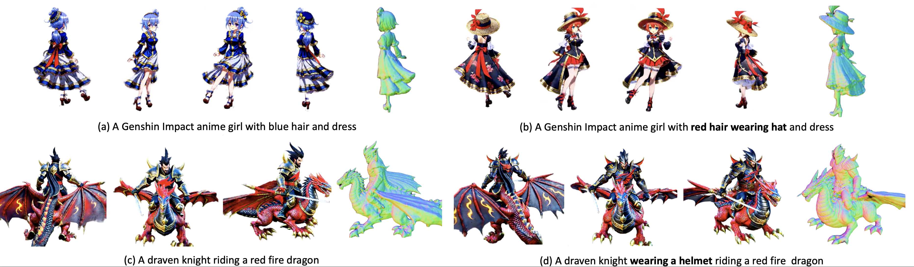

### Interactive3D: Create What You Want by Interactive 3D Generation
### NEWS
- 🔥 Interactive3D got accepted by CVPR24.
- Code will be released soon.

### Framework 
Interactive3D contains two stages with distinct 3D representations: (I) Gaussian Splatting for flexible user interactions such as add/remove parts; geometry transformation; deformable or rigid dragging and semantic editing, (II) the Gaussian blobs are converted to InstantNGP using NeRF distillation and fine-tined by our Interactive Hash Refinement Module.

