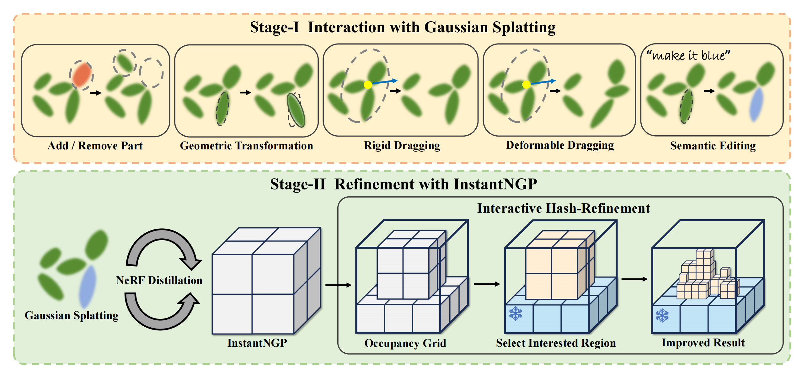

[comment]: <> (# Interactive3D: Create What You Want by Interactive 3D Generation)

<p align="center" width="100%">

</p>

<p align="center">

  <h1 align="center">Interactive3D: Create What You Want by Interactive 3D Generation</h1>
  <p align="center">
    <a href='https://scholar.google.com/citations?user=Pee4FRsAAAAJ&hl=en'><strong>Shaocong Dong<sup>*</sup></strong></a>
    ·
    <a href='https://dinglihe.github.io/'><strong>Lihe Ding<sup>*</sup></strong></a>
    ·
    <a href='https://dblp.org/pid/135/5933.html'><strong>Zhanpeng Huang</strong></a>
    ·
    <a href='https://dblp.org/pid/54/8616.html'><strong>Zibin Wang</strong></a>
    ·
    <a href='https://tianfan.info/'><strong>Tianfan Xue</strong></a>
    ·
    <a href='https://www.danxurgb.net/'><strong>Dan Xu</strong></a>
  </p>

<!--
<div align="center">
    <a href='https://scholar.google.com/citations?user=Pee4FRsAAAAJ&hl=en' target='_blank'>Shaocong Dong<sup>1*</sup></a>&emsp;
    <a href='https://dinglihe.github.io/' target='_blank'>Lihe Ding<sup>2,4*</sup></a>&emsp;
    <a>Zhanpeng Huang<sup>3</sup></a>&emsp;
    <a>Zibin Wang<sup>3</sup></a>&emsp;
    </br>
    <a href='https://tianfan.info/'> Tianfan Xue<sup>2</sup></a>
    <a href='https://www.danxurgb.net/'> Dan Xu<sup>1,†</sup></a>&emsp;
</div>
<div>

<div align="center">
    <sup>1</sup>
    <a> The Hong Kong University of Science and Technology</a>&emsp;
    </br>
    <sup>2</sup> <a>The Chinese University of Hong Kong</a>
    </br>
    <sup>3</sup> <a> SenseTime </a>
    <sup>4</sup> <a> Shanghai AI Laboratory </a></br>
    <sup>*</sup> Equal Contribution&emsp;
    <sup>†</sup> Corresponding Author&emsp;
</div>
-->

[comment]: <> (  <h2 align="center">PAPER</h2>)
  <h3 align="center"><a href="https://arxiv.org/abs/2404.16510">Paper</a> | <a href="https://interactive-3d.github.io/">Project Page</a> | <a href="https://youtu.be/ZYSOonigv3s">Video</a></h3>
  <div align="center"></div>

<p align="left" width="100%">

</p>

---

## NEWS
- 🔥 Interactive3D got accepted by CVPR24.
- Code will be released soon.


## Abstract 
<p align="left" width="100%">

</p>
Interactive3D is an innovative framework for interactive 3D generation that grants users precise control over the generative process through extensive 3D interaction capabilities. Interactive3D is constructed in two cascading stages, utilizing distinct 3D representations. The first stage employs Gaussian Splatting for direct user interaction, allowing modifications and guidance of the generative direction at any intermediate step through (i) Adding and Removing components, (ii) Deformable and Rigid Dragging, (iii) Geometric Transformations, and (iv) Semantic Editing. Subsequently, the Gaussian splats are transformed into InstantNGP. We introduce a novel (v) Interactive Hash Refinement module to further add details and extract the geometry in the second stage.

## Acknowledgement
Interactive3D is built on many amazing research works, thanks a lot to all the authors for sharing! Thank [Yiyuan](https://github.com/invictus717) for the valuable discussion and paper refinement.
- [gsgen](https://github.com/gsgen3d/gsgen) and [instant-ngp](https://github.com/NVlabs/instant-ngp)
- [threestudio](https://github.com/threestudio-project/threestudio)


## Citation
If the paper and the code are helpful for your research, please kindly cite:
```
@article{dong2024interactive3d,
  title={Interactive3D: Create What You Want by Interactive 3D Generation},
  author={Dong, Shaocong and Ding, Lihe and Huang, Zhanpeng and Wang, Zibin and Xue, Tianfan and Xu, Dan},
  journal={arXiv preprint arXiv:2404.16510},
  year={2024}
}
```
